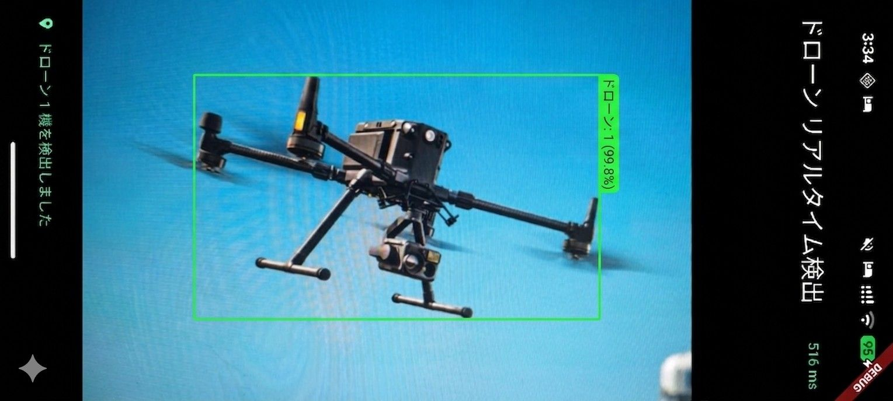
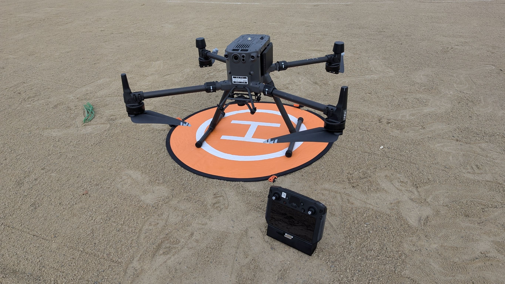
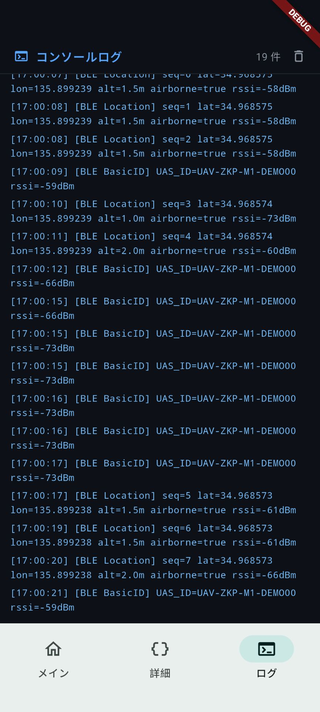
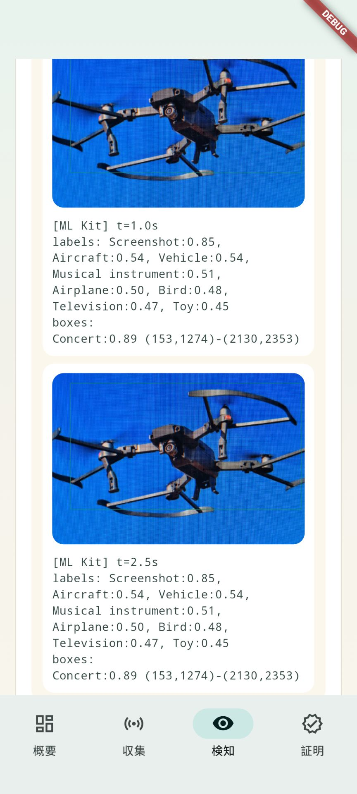
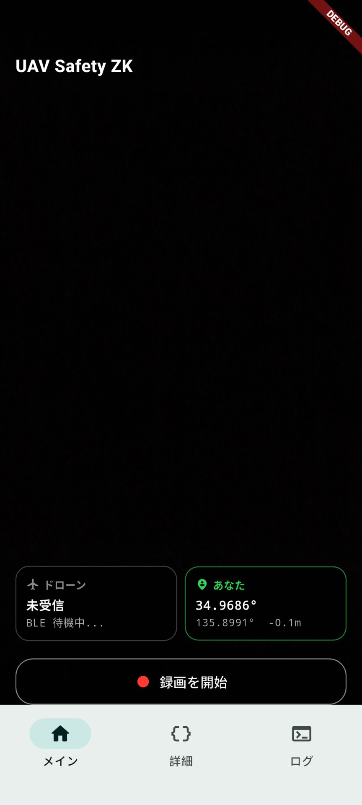
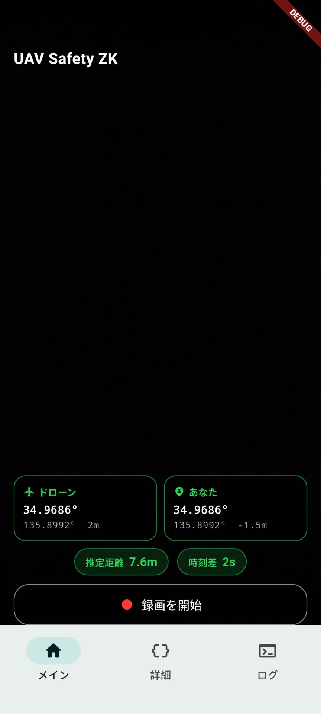

```markdown
*Read this in other languages: [English](README.en.md), [日本語](README.md).*

# zk-UAV-Proximity-Proof (旧: zkp-m1)

ドローンの位置情報と利用者の端末センサー情報を使って、`30m以内かつ5秒以内の接近` をゼロ知識証明で示すデモプロジェクトです。

<div align="center">

  <table border="0">
    <tr>
      <td align="center" valign="bottom">
        <br>
        <sub>TFLite モデル検知</sub>
      </td>
      <td align="center" valign="bottom">
        <br>
        <sub>実験用ドローン</sub>
      </td>
    </tr>
  </table>

  <table border="0">
    <tr>
      <td align="center" valign="bottom">
        <br>
        <sub>OpenDroneID ログ</sub>
      </td>
      <td align="center" valign="bottom">
        <br>
        <sub>Google ML Kit 検知</sub>
      </td>
      <td align="center" valign="bottom">
        <br>
        <sub>RemoteID 検知前</sub>
      </td>
      <td align="center" valign="bottom">
        <br>
        <sub>RemoteID 検知後</sub>
      </td>
    </tr>
  </table>

</div>

このリポジトリには次の 3 つが入っています。

- `circuits/` と `zk-distance/`: Circom 回路、Groth16 用成果物、最適化比較
- `rapidsnark_app/`: Android 向け Flutter アプリ
- `uav/remote_id.py`: Raspberry Pi 側の BLE テレメトリ送信スクリプト

## リポジトリ構成

- `circuits/distance_30m_time.circom`
  - 位置と時刻から `within30`, `distance_ok`, `time_ok` を出力する回路
- `circuits/distance_30m_time_series.circom` 等
  - 複数時刻の時系列位置情報を扱う回路や、物体検知フラグ、モデル推論結果コミットメント等と組み合わせた拡張回路群
- `scripts/build_distance_assets.sh` 等
  - 回路のコンパイル、Groth16 セットアップ、アプリ用 asset 更新を行うスクリプト群（各回路バリエーションに対応）
- `scripts/compare_circom_optimizations.sh`
  - `--O0 / --O1 / --O2` の比較
- `scripts/compare_distance_variant_constraints.sh`
  - 回路バリエーションごとの constraint 比較 CSV を生成
- `scripts/train_visdrone_yolo.sh`, `convert_visdrone_det_to_yolo.py` 等
  - YOLO モデルの学習、VisDrone フォーマットからの変換、TFLite エクスポートを行う ML 向けスクリプト群
- `scripts/generate_project_summary_slides.py`
  - プロジェクト概要をプレゼン用スライド (pptx) として自動生成するスクリプト
- `zk-distance/sample_input.json`
  - 回路のサンプル入力
- `rapidsnark_app/lib/main.dart`
  - デモアプリ本体 (Flutterアプリ、内部でYOLOモデルによるドローン検知を実行)
- `uav/remote_id.py`
  - Raspberry Pi から BLE manufacturer data を送信
- `uav/OPENDRONEID_IMPLEMENTATION.md`, `SENSOR_INTEGRATION.md` 等
  - OpenDroneID (ASTM F3411-22a) の実装詳細や、Raspberry Pi 上での実機センサー (GPS, BME280) 統合に関するドキュメント
- `visdrone/`
  - UAV (ドローン) の小物体検知に向けた YOLO 事前学習・ファインチューニング用のデータセット設定ファイル群

## 必要環境

最低限、次を用意してください。

- `circom`
- `snarkjs`
- `node`
- `cargo` / `rustc`
- `Flutter`
- Android 実機

このリポジトリで確認していた主なバージョンは [zk-distance/README.md](/Users/smri/Downloads/cursor/m1/zk-distance/README.md) にあります。

## 1. 回路成果物を作る

まず回路と証明用成果物を作ります。

```bash
./scripts/build_distance_assets.sh
```
```
このスクリプトは次を行います。
 * Circom 回路を O2 でコンパイル
 * Powers of Tau と Groth16 セットアップ
 * サンプル witness / proof / public signals の生成
 * アプリ用 zkey と verification key の更新
 * build-circuit が使えれば .wcd も生成
build-circuit を自前で用意する場合は:
```bash
git clone [https://github.com/iden3/circom-witnesscalc.git](https://github.com/iden3/circom-witnesscalc.git) /tmp/circom-witnesscalc
cd /tmp/circom-witnesscalc
cargo build --release -p build-circuit
BUILD_CIRCUIT_BIN=/tmp/circom-witnesscalc/target/release/build-circuit ./scripts/build_distance_assets.sh

```
## 2. Raspberry Pi 側を起動する
Raspberry Pi 側では remote_id.py が BLE 広告を送ります。
固定値を送る例:
```bash
python3 uav/remote_id.py --lat 35.6891390 --lon 139.6917000 --alt 12.0

```
JSON から送る例:
```bash
python3 uav/remote_id.py --json-path uav_sample.json

```
送信 payload の仕様:
 * company_id = 0x02E5
 * magic = 0x5A
 * version = 0x01
 * lat_e7 signed int32 little-endian
 * lon_e7 signed int32 little-endian
 * altitude_dm signed int16 little-endian
 * unix_time_sec uint32 little-endian
 * sequence uint8
補足:
 * hciconfig / hcitool を使うため、Pi 側では Bluetooth 関連ツールが必要です
 * スクリプト内で sudo を使うので、実行権限や sudo 権限が必要です
## 3. アプリを起動する
```bash
cd rapidsnark_app
flutter pub get
flutter run

```
### アプリで必要な権限
 * Android
   * BLUETOOTH_SCAN
   * BLUETOOTH_CONNECT
   * ACCESS_FINE_LOCATION
   * CAMERA
 * iOS
   * NSBluetoothAlwaysUsageDescription
   * NSLocationWhenInUseUsageDescription
   * NSCameraUsageDescription
### 現在の入力方式
アプリの 収集 タブでは、ドローン側ログを 2 通りで入れられます。
 * 手入力
 * Raspberry Pi BLE 受信
利用者側ログはスマホの GPS と気圧センサーから取得します。
## 4. デモ手順
おすすめの実演手順は次の通りです。
 1. Raspberry Pi で BLE テレメトリ送信を開始する
 2. アプリの 収集 タブでドローン側入力モードを選ぶ
 3. Raspberry Pi モードなら Raspberry Pi から受信 を押す
 4. この端末の値を使う で利用者側ログを取得する
 5. BLE受信から撮影まで進む または 端末情報を取得して撮影 を押す
 6. 動画解析で UAV 候補が検知されたら 動画検知で証明実行 または 証明 タブへ進む
 7. Public Signals と判定結果を確認する
## 5. いまの見どころ
 * 回路は 30m以内 と 5秒以内 を同時に判定
 * アプリ内で witness 計算、Groth16 証明、検証まで完結
 * Raspberry Pi の BLE 広告をアプリで受信可能
 * VisDrone で事前学習・ファインチューニングした YOLO モデルによるドローンのリアルタイム画像認識機能
 * OpenDroneID に準拠した BLE アドバタイズパケットの生成と実機 GPS / 気圧センサーとの連携
 * --O0 / --O1 / --O2 の比較レポートも含む
 * 回路バリエーション別の constraint 比較 CSV も生成可能
## 関連ドキュメント
 * zk-distance/README.md
 * rapidsnark_app/README.md
 * optimization_report.md
 * visdrone/README.md
 * uav/OPENDRONEID_IMPLEMENTATION.md
 * uav/OPENDRONEID_COMPLIANCE_LOG.md
 * uav/SENSOR_INTEGRATION.md

```
