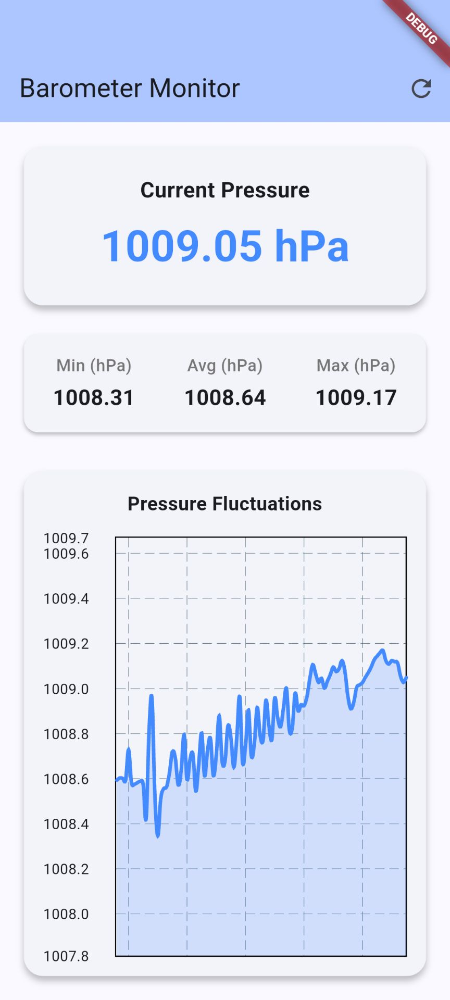

# Barometric Pressure Accuracy Checker

A Flutter application designed to verify the accuracy and precision of the device's built-in barometric pressure sensor in real-time.



## Features

- **Real-Time Pressure**
  - Connects to the device's hardware barometer via the `sensors_plus` package.
  - Displays the current atmospheric pressure in hectopascals (hPa).
- **Statistical Tracking**
  - Calculates and tracks the Minimum, Average, and Maximum pressure readings over the course of the session.
- **Fluctuation Visualization**
  - Features a dynamic, auto-scrolling line chart built with `fl_chart`.
  - Visualizes the most recent 100 pressure data points to easily spot sensor noise, drift, and erratic fluctuations.
- **Session Control**
  - Includes a reset button to flush historical data and start a fresh tracking session immediately.

## Getting Started

### Prerequisites

- [Flutter SDK](https://flutter.dev/docs/get-started/install) 
- An Android or iOS device equipped with a hardware barometric pressure sensor.
  - *Note: Most desktop environments and simulators/emulators do not provide real barometer data. Running this app on a physical device is highly recommended.*

### Running the App

1. Ensure your physical device is connected and recognized by ADB or Xcode.
2. Fetch dependencies:
   ```bash
   flutter pub get
   ```
3. Run the application:
   ```bash
   flutter run
   ```

## Dependencies

- [`sensors_plus`](https://pub.dev/packages/sensors_plus): For accessing hardware sensor data.
- [`fl_chart`](https://pub.dev/packages/fl_chart): For drawing the dynamic tracking chart.
